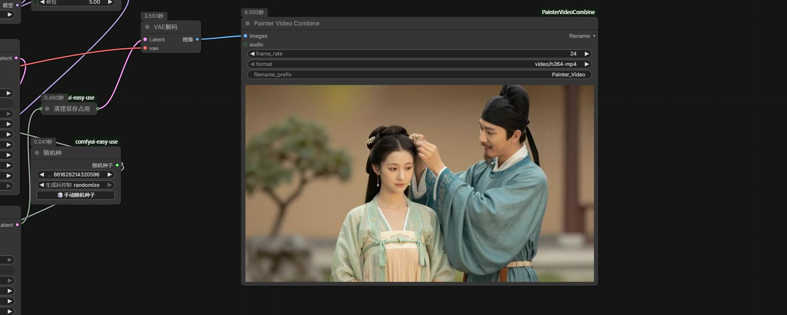

# PainterVideoCombine 此节点由抖音博主:绘画小子 制作

A lightweight and intuitive video synthesis node for ComfyUI.  
轻量直观的 ComfyUI 视频合成节点。

---


## ✨ Features / 特性

- **Simple & Clean UI** – No clutter, just what you need.  
  **界面简洁** – 无冗余元素，只保留核心功能。

- **Adjustable Frame Rate** – Set FPS directly in the node (unlike ComfyUI’s built-in `SaveImage` video saver).  
  **可直接设置帧率** – 在节点内自由指定 FPS，官方保存视频节点无法做到。

- **Instant Video Preview** – Automatically displays the output video inside the node after generation.  
  **自动生成预览** – 合成完成后自动在节点内嵌播放视频，无需手动查找文件。

- **Fast Encoding** – Uses optimized FFmpeg settings for quick export.  
  **合成速度快** – 采用高效 FFmpeg 参数，导出迅速。

- **Muted by Default, Sound on Hover** – Videos play silently at first; audio unmutes automatically when you hover over the preview.  
  **默认静音，悬停发声** – 视频初始静音播放，鼠标移入预览区域时自动开启声音，避免干扰。

---

## 📦 Installation / 安装

1. Open your ComfyUI `custom_nodes` folder.  
   打开 ComfyUI 的 `custom_nodes` 文件夹。

2. Run:  
   执行以下命令：

   ```bash
   git clone https://github.com/princepainter/ComfyUI-PainterVideoCombine.git
重启 ComfyUI，节点将出现在 Painter/Video 分类下。

🎥 Usage / 使用方法

Connect image frames to the images input, set your desired frame_rate, choose format (MP4, WebM, or GIF), and optionally attach an AUDIO input.
将图像序列接入 images 输入端口，设置所需帧率，选择格式（MP4/WebM/GIF），并可选连接音频输入。

The output video will be saved and automatically previewed in the node.
合成后的视频将自动保存，并在节点内实时预览。
🔕 Audio is muted by default. Move your mouse over the video to hear sound.
🔕 默认静音。将鼠标悬停在视频上即可听到声音。

📝 Note / 说明

Requires ffmpeg (automatically fetched via imageio-ffmpeg if not found).
需要 ffmpeg（若未安装，会通过 imageio-ffmpeg 自动获取）。

Enjoy smooth and silent video synthesis! 
享受流畅静谧的视频合成体验！
